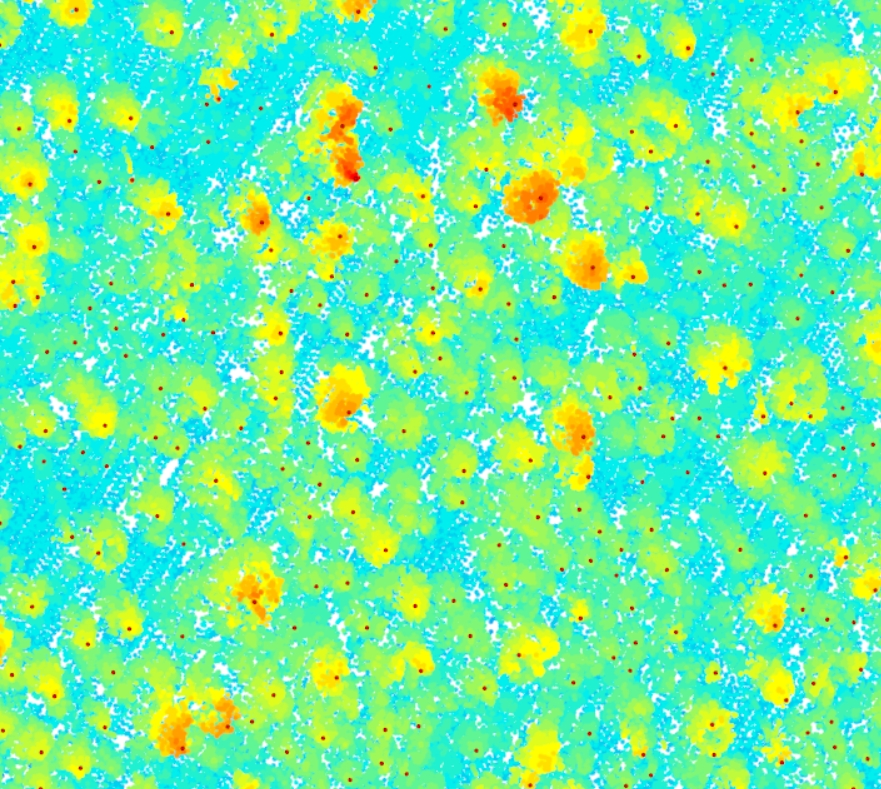

```{r setup, include=FALSE}
knitr::opts_chunk$set(echo = TRUE)
```


```{r}
## Dependencies
library(sf)
library(raster)
library(terra)
library(raster)
library(tmap)
library(tmaptools)
library(lidR)
library(ggplot2)
library(leaflet)
```

## Assignment
Develop a research methodology guided by a LiDAR dataset (the one provided or data found from the list below) aimed at exploring its potential applications and insights. Reflect on the perspectives and revelations drawn from your visualization of this data. Critically analyze the advantages and complexities inherent in the utilization of 3D geovisualization. Additionally, provide an assessment of the trajectory of 3D technology, including immersive environments, within the academic and professional landscape. (Maximum 4 paragraphs)

Downloading LiDAR point clouds can be done from various sources, including government agencies, research organizations, and commercial data providers. Here are some places where you can potentially find LiDAR data:

1. USGS 3D Elevation Program (3DEP): The United States Geological Survey (USGS) offers LiDAR data for the United States through the 3DEP program. You can access this data through the National Map or other USGS data portals.

2. National Oceanic and Atmospheric Administration (NOAA): NOAA provides LiDAR data for coastal regions and bathymetric LiDAR data for underwater mapping. You can access this data through the NOAA Digital Coast website.

3. OpenTopography: OpenTopography is a platform that provides access to LiDAR data from various sources. It offers a user-friendly interface for searching and downloading LiDAR datasets.

4. State and Local Government Websites: Many state and local government agencies provide LiDAR data for specific regions. You can check their websites or contact them directly for access.

5. NASA Earthdata: NASA provides various Earth science data, including LiDAR data, through its Earthdata Search portal.

6. USDA LiDAR Data: The United States Department of Agriculture (USDA) offers LiDAR data through its Forest Service and NRCS (Natural Resources Conservation Service) programs. You can access this data through their respective websites.

7. NEON: The National Ecological Observatory Network (NEON) is a program funded by the National Science Foundation (NSF) that collects and provides ecological data from various sites across the United States. NEON operates a network of field sites equipped with various instruments, including LiDAR (Light Detection and Ranging) systems, to gather data on the environment, ecosystems, and biodiversity. These LiDAR data can be valuable for a wide range of ecological and environmental research. (https://data.neonscience.org/)


#Research on difference canopy characteristics between adjacent shady slopes and sunny
#slopes(Using the example of Northern Rockies, Montana)
Although shady slopes and sunny slopes are close to each other in the same area, due to the terrain heterogeneity, these two places often differentiate in precipitation, solar insolation, wind speed, temperature, etc. And the different natural characteristics will cause different growing traits in trees grown in the two kinds of slopes. This research aims to detect the height of trees in a valley area in Northern Rockies. This work could be done by in situ measurement, but using lidar data and lidar analysis package in R, we might complete this mission in a much more easy way.  


1.Data Collecting and Pre-processing
The dataset of Northern Rockies used in this study is provided by Opentopology(https://portal.opentopography.org/lidarDataset?opentopoID=OTLAS.062017.26911.1).
Base on the dataset we're going to use and the research topics, we need to read the point cloud file(las) and the shapefiles(which respectively refer to shady and sunny slopes), and reproject them to the same spatial cooordinate system (EPSG: 8705).
```{r}
las_rockies <- readLAS('assignment_las/Rockies.laz')
print(las_rockies[2])
CRS("+init=epsg:8705")
las_rockies<- st_transform(las_rockies,st_crs(8705))
plot(las_rockies)

#Add Shady and Sunny Slopes Areas
shady <- sf::st_read('assignment_las/Shady.shp',quiet=TRUE)
shady <- st_transform(shady,st_crs(8705))

sunny <- sf::st_read('assignment_las/Sunny.shp',quiet=TRUE)
sunny <- st_transform(sunny,st_crs(8705))


sunny_leaf <- st_transform(sunny,st_crs(4326))
shady_leaf <- st_transform(shady,st_crs(4326))

leaflet() %>% 
  addProviderTiles('CartoDB.Positron') %>%
  addTiles() %>%  
    addPolygons(data = shady_leaf, fillColor = "blue", fillOpacity = 0.5, color = "white", weight = 1) %>%
  addPolygons(data = sunny_leaf, fillColor = "red", fillOpacity = 0.5, color = "white", weight = 1)

```

2.Ground classification
This step will help distinguish between ground and non-ground points allows creation of a continuous model of terrain elevation(DTM), which will be a great help for the following steps.
```{r}
#Ground Classification of the cloud point data
las <- classify_ground(las_rockies, algorithm = pmf(ws = 5, th = 3))
plot(las, color = "Classification", size = 3, bg = "white") 
summary(las)


#Select a crossection line to display the classification result.
plot_crossection <- function(las,
                             p1 = c(min(las@data$X), mean(las@data$Y)),
                             p2 = c(max(las@data$X), mean(las@data$Y)),
                             width = 4, colour_by = NULL)
{
  colour_by <- rlang::enquo(colour_by)
  data_clip <- clip_transect(las, p1, p2, width)
  p <- ggplot(data_clip@data, aes(X,Z)) + geom_point(size = 0.5) + coord_equal() + theme_minimal()

  if (!is.null(colour_by))
    p <- p + aes(color = !!colour_by) + labs(color = "")

  return(p)
}
p1 <- c(5656255,3035420)
p2 <- c(5658460,3037870)
plot_crossection(las, p1 , p2, colour_by = factor(Classification))
```
3.Create DTM(Digital Terrain Model)
DTM will only consider the terrain and leave out tree heights based on the last classification steps. DTM can be used to normalize the terrain of the original point cloud dataset to generate a new dataset that only tree heights are included.
```{r}
dtm_tin <- rasterize_terrain(las, res = 3, algorithm = tin())
plot_dtm3d(dtm_tin, bg = "white")
```

4.Heights Normalization
Normalize terrain based on the created DTM, only tree height will be reserved after normalization, that we eliminate the diiference caused by different terrain in our research area. 
```{r}
nlas <- normalize_height(las, knnidw(),dtm = dtm_tin)
plot(nlas, size = 4, bg = "white")
nlas_shady <- clip_roi(nlas,shady)
nlas_sunny <- clip_roi(nlas,sunny)
```

5.Create CHM(Canopy Height Model)
In the case of a normalized point cloud, the derived surface represents the canopy height (for vegetated areas) and is referred to as CHM, thus tree heights of shady and sunny slopes can be derived through CHM data.
```{r}
chm_shady <- rasterize_canopy(nlas_shady, res = 4,algorithm = p2r())
plot(chm_shady)
chm_sunny <- rasterize_canopy(nlas,res = 4, algorithm = p2r())
plot(chm_sunny)
```

6. Tree Heights Calculation
Tree tops can be detected by applying a Local Maximum Filter (LMF) on the loaded data set, the algorithm will search the hightest point of the specified window size(ws) to count its height as the tree height, can all the tree heights of the research area will be collected to a data frame. 

```{r}
ttops_shaddy <- locate_trees(nlas_shady, lmf(ws=20))
print(c("Mean Tree Height in Shady Slopes(ft):",mean(ttops_shaddy$Z)))
ttops_sunny <- locate_trees(nlas_sunny,lmf(ws=20))
print(c("Mean Tree Height in Sunny Slopes(ft):",mean(ttops_sunny$Z)))

```

We can check if the top points the algorithm extract align with the cloud point data: 

```{r}
x <- plot(nlas_shady, bg = "white", size = 4)
add_treetops3d(x, ttops_shaddy)
```




Now we successfully calculate and compare the mean tree heights between shady and sunny slopes, which are approximately 46.21 feet and 44.52 feet. Now we can draw the conclusion that trees grown in shady slopes are tend to have more heights than the trees grown in sunny slopes. This result aligns well with our anticipation that shadier areas tend to retain more moisture due to less evaporation from sunlight. This means trees in these areas often have more water available for growth. 

What's more, we can compare the mean tree crown areas of these two slopes using Individual Tree Segmentation(ITS)
```{r}
algo_shady <- dalponte2016(chm_shady, ttops_shaddy)
nlas_shady_seg <- segment_trees(nlas_shady, algo_shady) # segment point cloud
crowns_shady <- crown_metrics(nlas_shady_seg, func = .stdtreemetrics, geom = "convex")
plot(crowns_shady["convhull_area"], main = "Crown Area of Shady Slopes (convex hull)")
print(c('Mean Tree Crown Areas in Sunny Slopes(ft^2)',mean(crowns_shady$convhull_area)))
```

```{r}
algo_sunny <- dalponte2016(chm_sunny, ttops_sunny)
nlas_sunny_seg <- segment_trees(nlas_sunny, algo_sunny) # segment point cloud
crowns_sunny <- crown_metrics(nlas_sunny_seg, func = .stdtreemetrics, geom = "convex")
plot(crowns_sunny["convhull_area"], main = "Crown Area of Shady Slopes (convex hull)")
print(c('Mean Tree Crown Areas in Sunny Slopes(ft^2)',mean(crowns_sunny$convhull_area)))
```
We can see that tree crown areas of the two kinds of slopes are similar.


In terms of the advantages of 3D - Visualization, I think that 1) the visualization of cloud point can help me better check out if there are some outliers in the area that needs to be removed and if all the detected results from tree top identification algorithm are correctly identified the trees, which are extremely difficult to achieve using just 2D - Visualization method.
As for the complexities, I think that 1)the process of creating 3D geovisualization might be time-consuming because it involves not only creating the graphic but also ensuring its accuracy 2) the result gained from the calculation based on the lidar imagery analysis package are not convincible enough so for most of the scientific research, the research may oftern need to do an in situ validation again.


trajectory of 3D technology:
(1)Academic Landscape
GIS data analysis focus more on 2D analytics methods nowadays since the current mainstream data structure (like GTiff, shp) are designed to store and display 2D data only, but as the trend of using 3D data to explore and simulate complex world entities, 3D technology will help researcher develop more types of data structure and algorithm to better store and process the 3D data. 
(2)Professional Landscape
3D technology can be combined with virtual reality, using Lidar-based imagery as the data source, we can apply it to more realms like digital humanities that allows us to use 3D technology to store and rebuild the arts or culture relics in a digital type of format. It will definitely help with spread and preserve culture varities.


| Evaluation              | *Highly well-done* 	|*Well-done* 	| *Some deficiencies* 	| *Several deficiencies* 	|
|--------------------------|-------------|-------------|-------------|-------------|
| **Cartographic principles** - 20% (title, name, date, north arrow, scale, legend, explanation symbols)  | Elements present and correctly portrayed (100%) 	| Most elements present and correctly portrayed (99-80%) 	| Some elements  (when appropriate) present and correctly portrayed (79-50%) 	| Minimal  information (<50%) 	|
| **Presentation and  Legibility** - 20% (readable, consistency and ease of understanding, flow of ideas consistent with cognition, clear explanation of content)  	| Highly legible, consistent and easy to  understand (100%) 	| Mostly legible, consistent and easy to   understand (99 -80%) 	| Somewhat legible, consistent and easy to understand (79-50%) 	| Minimally legible, consistent and poorly   understandable (<50%) 	|
| **Content**  -   20% (relevant, coherent and interesting topic, appropriate subject matter   given the presented information/data, free of bias and error ) 	| Highly relevant coherent, and interesting;   consistent information free of bias and error (100%) 	| Mostly relevant coherent, and interesting;    consistent information free of bias and error (99 -80%) 	| Somewhat relevant coherent, and interesting;   some inconsistencies in information(79-50%) 	| Minimally relevant coherent, and interesting;   inconsistencies in information  (<50%) 	|
| **Aesthetics**    - 20% (is the map attractive, are there objective elements that are popularly viewed as beautiful)  | Highly attractive/ beautiful (100%) 	| Mostly attractive/ beautiful (99 -80%) 	| Somewhat attractive/beautiful (79-50%) 	| Minimally attractive beautiful (<50%) 	|
| **Creativity and  persuasiveness**  - 20% (imaginative information/data,   convincing argumentation, presence of sustainability principles) 	| Highly imaginative; convincing of   sustainability  principles (100%) 	| Mostly imaginative; convincing of   sustainability  principles (99   -80%) 	| Somewhat imaginative; less convincing of   sustainability  principles (79-50%) 	| Minimally imaginative; not convincing of   sustainability  principles (<50%)    |
